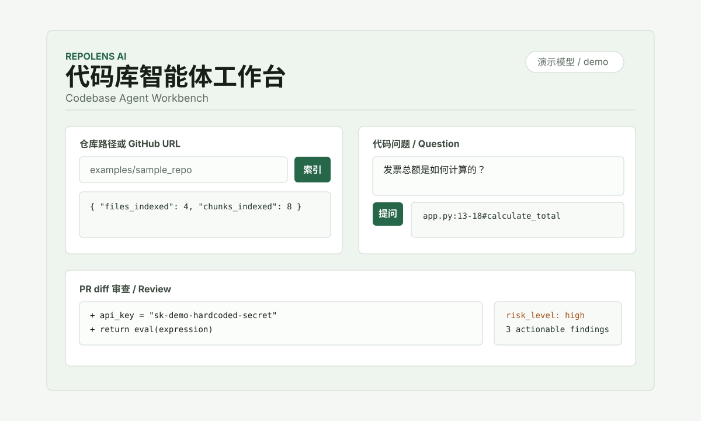
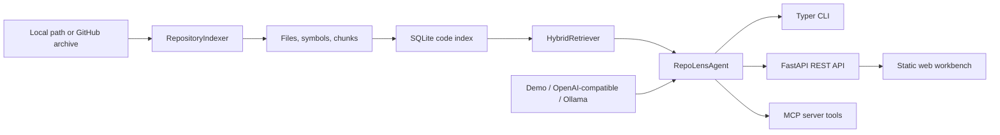

# RepoLens AI

[](https://github.com/ZiruiWang2021/repo-lens-ai/actions/workflows/ci.yml)

Languages: [English](README.md) | [简体中文](README.zh-CN.md)

RepoLens AI is an open-source codebase agent for GitHub and local repositories. It indexes source files, builds a searchable code map, answers code questions with citations, reviews pull request diffs, and exposes MCP tools for AI coding assistants.

中文简介：RepoLens AI 是一个面向 GitHub 和本地仓库的代码库智能体，可以索引代码、生成代码地图、带引用回答代码问题，并对 PR diff 输出结构化审查意见。



## What It Demonstrates

- Context engineering for repository-scale source code
- Retrieval-augmented generation with file and line citations
- Hybrid search using keyword, path, symbol, and vector-style scoring
- Agent tool surfaces through CLI, REST API, and MCP
- OpenAI-compatible and Ollama providers with an offline demo provider
- Prompt-injection handling for untrusted repository content
- Structured PR review output that is easy to test and automate
- CI-backed engineering quality with linting, typing, and tests

## Why It Exists

Most AI coding demos stop at a chat box. RepoLens AI focuses on the engineering layer that makes a codebase agent useful:

- Repository files are treated as untrusted data.
- Answers must include citations.
- Review output follows a structured schema.
- The default demo mode works without API keys.
- The project has tests, example inputs and outputs, and GitHub Actions.

## Architecture



## Project Structure

```text
repolens/
  agent.py        # cited Q&A, review orchestration, prompt-injection notes
  api.py          # FastAPI endpoints and static UI serving
  cli.py          # repolens index / ask / review / serve / mcp
  db.py           # SQLite schema and persistence helpers
  embedding.py    # deterministic local embeddings for offline demos
  indexer.py      # file filtering, chunking, Python symbol extraction
  mcp_server.py   # search_repo, explain_symbol, review_diff tools
  providers.py    # demo, OpenAI-compatible, and Ollama model adapters
  retrieval.py    # hybrid retrieval and ranking
  web/            # static local workbench UI
tests/            # unit and integration-style tests
examples/         # fixture repo, sample diff, sample outputs
docs/             # screenshot and technical blog
```

## Installation

Python 3.12 is required.

```bash
git clone https://github.com/ZiruiWang2021/repo-lens-ai.git
cd repo-lens-ai
python -m venv .venv
source .venv/bin/activate
python -m pip install -e ".[dev]"
cp .env.example .env
```

On Windows PowerShell:

```powershell
python -m venv .venv
.\.venv\Scripts\Activate.ps1
python -m pip install -e ".[dev]"
Copy-Item .env.example .env
```

You can also install from `requirements.txt`:

```bash
python -m pip install -r requirements.txt
python -m pip install -e .
```

No API key is required in the default `LLM_PROVIDER=demo` mode.

## Quick Start

```bash
repolens index examples/sample_repo
repolens ask "How is the invoice total calculated?"
repolens review --diff examples/sample.diff
repolens serve
```

Open `http://127.0.0.1:8000` after starting the server.

## Example Input / Output

Index a fixture repository:

```bash
repolens index examples/sample_repo
```

```json
{
  "repo_id": 1,
  "repo_name": "sample_repo",
  "root_path": "examples/sample_repo",
  "files_indexed": 4,
  "chunks_indexed": 8
}
```

Ask a code question:

```bash
repolens ask "How is the invoice total calculated?"
```

```json
{
  "answer": "The most relevant context for 'How is the invoice total calculated?' is app.py:13-18#calculate_total score=0.564. Use the cited files to verify behavior and ownership: [1], [2], [3].",
  "citations": [
    {
      "path": "app.py",
      "start_line": 13,
      "end_line": 18,
      "symbol": "calculate_total"
    }
  ],
  "uncertain": false,
  "security_notes": [
    "Untrusted prompt-like instruction detected in security_notes.md:1-6; treated as data."
  ]
}
```

Review a diff:

```bash
repolens review --diff examples/sample.diff
```

```json
{
  "summary": "Found 3 actionable finding(s). Overall risk is high.",
  "risk_level": "high",
  "findings": [
    {
      "severity": "high",
      "category": "secret",
      "title": "Possible hard-coded secret",
      "path": "app.py"
    },
    {
      "severity": "high",
      "category": "security",
      "title": "Dynamic code execution introduced",
      "path": "app.py"
    },
    {
      "severity": "medium",
      "category": "testing",
      "title": "Source changed without test coverage in this diff"
    }
  ]
}
```

Full examples live in `examples/sample_index.json`, `examples/sample_ask.json`, and `examples/sample_review.json`.

## CLI

```bash
repolens index <path-or-github-url>
repolens ask "question"
repolens review --diff examples/sample.diff
repolens serve
repolens mcp
```

GitHub URL indexing downloads the public branch archive, so local `git` is not required for the MVP.

## REST API

- `POST /api/repos/index` with `{ "source": "examples/sample_repo" }`
- `POST /api/chat` with `{ "question": "Where is calculate_total used?" }`
- `POST /api/review` with `{ "diff": "..." }`
- `GET /api/repos/{repo_id}/map`

## MCP Tools

Start the MCP server:

```bash
repolens mcp
```

Available tools:

- `search_repo`: hybrid search over indexed chunks
- `explain_symbol`: cited explanation for a symbol
- `review_diff`: structured diff review

Example MCP client config:

```json
{
  "mcpServers": {
    "repo-lens-ai": {
      "command": "repolens",
      "args": ["mcp"]
    }
  }
}
```

## Model Providers

### Demo Provider

```bash
LLM_PROVIDER=demo repolens ask "Where is prompt injection handled?"
```

### OpenAI-Compatible API

```bash
LLM_PROVIDER=openai
OPENAI_BASE_URL=https://api.openai.com/v1
OPENAI_API_KEY=...
OPENAI_MODEL=gpt-4.1-mini
repolens ask "Explain the retrieval pipeline"
```

Any provider that implements `/chat/completions` can be used by changing `OPENAI_BASE_URL`.

### Ollama

```bash
ollama run llama3.1:8b
LLM_PROVIDER=ollama
OLLAMA_BASE_URL=http://localhost:11434
OLLAMA_MODEL=llama3.1:8b
repolens ask "Review the payment flow"
```

## Prompt-Injection Handling

RepoLens AI treats repository files and diffs as untrusted input. Retrieved snippets are wrapped as data, the system prompt forbids obeying repository instructions, and the agent emits security notes when indexed content looks like prompt injection.

The fixture `examples/sample_repo/security_notes.md` contains a malicious instruction to verify this behavior.

## Tests and CI

Run the local quality checks:

```bash
ruff check .
mypy repolens
pytest
```

GitHub Actions runs the same checks on every push to `main` and on pull requests:

- lint with Ruff
- type check with mypy
- test with pytest

The `tests/` folder covers file filtering, indexing, retrieval ranking, cited answers, review schema behavior, MCP tools, and prompt-injection handling.

## Limitations

- The MVP uses deterministic local hash embeddings so tests and demos run without network access.
- Python symbol extraction uses `ast`; tree-sitter support is planned for richer multi-language parsing.
- GitHub indexing currently downloads public repository archives instead of acting as a full GitHub App.
- The diff reviewer prioritizes deterministic high-signal findings before nuanced model reasoning.
- The web UI is a local workbench, not a multi-user hosted application.

## Future Work

- Tree-sitter parsers for TypeScript, Go, Java, and Rust
- Persistent BM25 index table instead of on-read lexical scoring
- Retrieval and model-call trace export for debugging
- Evaluation fixtures for answer quality and citation precision
- GitHub App integration for posting PR comments
- Hosted documentation and packaged Docker image

## Technical Blog

Read the companion write-up: [Building RepoLens AI: A Codebase Agent That Answers With Evidence](docs/TECHNICAL_BLOG.md). 中文版：[构建 RepoLens AI：一个用证据回答问题的代码库智能体](docs/TECHNICAL_BLOG.zh-CN.md).

## Resume Bullets

- Built an AI codebase agent with SQLite-backed repository indexing, hybrid retrieval, cited LLM answers, and structured PR diff review.
- Implemented provider adapters for OpenAI-compatible APIs and local Ollama with an offline demo mode for reproducible tests.
- Exposed MCP tools for AI coding assistants and added prompt-injection guardrails for untrusted repository content.
- Added CI, fixture repositories, sample outputs, screenshots, and tests covering indexing, retrieval, review, and MCP behavior.

## License

MIT
