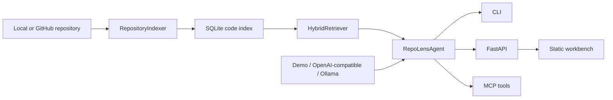

# RepoLens AI

RepoLens AI is a codebase agent for GitHub and local repositories. It indexes source files, builds a searchable code map, answers questions with citations, reviews unified diffs, and exposes MCP tools for AI coding assistants.

The project is intentionally shaped as a resume-grade AI engineering project: it demonstrates Context Engineering, RAG, tool calling, MCP, prompt-injection handling, streaming-ready provider adapters, and testable offline behavior.

## Why It Exists

Most AI coding demos stop at a chat box. RepoLens AI focuses on the engineering layer that makes codebase agents useful:

- repository content is treated as untrusted data
- answers include file citations
- review output is structured and testable
- the default demo mode runs without API keys
- OpenAI-compatible APIs and local Ollama are both supported

## Architecture



## Quick Start

```bash
python -m venv .venv
. .venv/bin/activate
python -m pip install -e ".[dev]"
cp .env.example .env
repolens index examples/sample_repo
repolens ask "How is the invoice total calculated?"
repolens review --diff examples/sample.diff
repolens serve
```

Open `http://127.0.0.1:8000` after starting the server.

No API key is required in the default `LLM_PROVIDER=demo` mode.

## Model Providers

### Demo

```bash
LLM_PROVIDER=demo repolens ask "Where is prompt injection handled?"
```

### OpenAI-Compatible API

```bash
LLM_PROVIDER=openai
OPENAI_BASE_URL=https://api.openai.com/v1
OPENAI_API_KEY=...
OPENAI_MODEL=gpt-4.1-mini
repolens ask "Explain the retrieval pipeline"
```

Any provider that implements `/chat/completions` can be used by changing `OPENAI_BASE_URL`.

### Ollama

```bash
ollama run llama3.1:8b
LLM_PROVIDER=ollama
OLLAMA_BASE_URL=http://localhost:11434
OLLAMA_MODEL=llama3.1:8b
repolens ask "Review the payment flow"
```

## CLI

```bash
repolens index <path-or-github-url>
repolens ask "question"
repolens review --diff examples/sample.diff
repolens serve
repolens mcp
```

GitHub URL indexing downloads the public branch archive, so local `git` is not required for the MVP.

## REST API

- `POST /api/repos/index` with `{ "source": "examples/sample_repo" }`
- `POST /api/chat` with `{ "question": "Where is calculate_total used?" }`
- `POST /api/review` with `{ "diff": "..." }`
- `GET /api/repos/{repo_id}/map`

## MCP

Start the server:

```bash
repolens mcp
```

Tools:

- `search_repo`: hybrid search over indexed chunks
- `explain_symbol`: cited explanation for a symbol
- `review_diff`: structured diff review

Example MCP client config:

```json
{
  "mcpServers": {
    "repo-lens-ai": {
      "command": "repolens",
      "args": ["mcp"]
    }
  }
}
```

## Prompt-Injection Handling

RepoLens AI treats repository files and diffs as untrusted input. Retrieved snippets are wrapped as data, the system prompt explicitly forbids obeying repository instructions, and the agent emits security notes when indexed content looks like prompt injection.

The fixture `examples/sample_repo/security_notes.md` contains a malicious instruction to verify this behavior.

## Testing

```bash
python -m unittest discover -s tests
```

With development dependencies installed:

```bash
ruff check .
mypy repolens
pytest
```

## Resume Bullets

- Built an AI codebase agent with SQLite-backed repository indexing, hybrid retrieval, cited LLM answers, and PR diff review.
- Implemented provider adapters for OpenAI-compatible APIs and local Ollama with an offline demo mode for reproducible tests.
- Exposed MCP tools for AI coding assistants and added prompt-injection guardrails for untrusted repository content.
- Added CI, fixture repositories, structured review schemas, and tests covering indexing, retrieval, review, and MCP behavior.

## Design Tradeoffs

- The MVP uses deterministic local hash embeddings so tests and demos work without network access.
- Python symbol extraction uses `ast` first; tree-sitter support is planned for richer multi-language parsing.
- The diff reviewer combines deterministic heuristics with LLM-ready structure, making high-risk findings testable before model output is involved.
