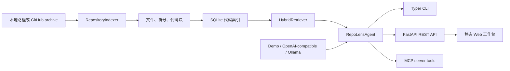

# RepoLens AI

[](https://github.com/ZiruiWang2021/repo-lens-ai/actions/workflows/ci.yml)

语言版本：[English](README.md) | [简体中文](README.zh-CN.md)

RepoLens AI 是一个面向 GitHub 和本地仓库的开源代码库智能体。它可以索引源码文件、构建可检索的代码地图、基于引用回答代码问题、审查 pull request diff，并通过 MCP 工具接入 AI 编程助手。


## 项目亮点

- 面向代码库的 Context Engineering
- 基于 RAG 的代码问答，并返回文件和行号引用
- 混合检索：关键词、路径、符号和向量式相似度综合排序
- 多种 Agent 接口：CLI、REST API、MCP
- 支持 OpenAI-compatible API、Ollama 和无需 API Key 的 demo provider
- 将仓库内容视为不可信输入，包含 prompt injection 防护
- PR diff 审查输出结构化结果，便于测试和自动化
- 使用 Ruff、mypy、pytest 和 GitHub Actions 保证工程质量

## 为什么做这个项目

很多 AI coding demo 只展示一个聊天框，但真正有用的代码库智能体更依赖工程能力：

- 仓库文件必须被当作不可信数据处理。
- 回答必须带引用，方便开发者验证。
- 审查结果需要结构化，方便进入自动化流程。
- 默认演示模式不依赖付费 API Key。
- 项目需要有测试、示例输入输出和 CI。

## 架构



## 项目结构

```text
repolens/
  agent.py        # 带引用问答、审查编排、prompt injection 提示
  api.py          # FastAPI 接口和静态 UI
  cli.py          # repolens index / ask / review / serve / mcp
  db.py           # SQLite schema 和持久化
  embedding.py    # 本地确定性 embedding，保证离线可演示
  indexer.py      # 文件过滤、代码切块、Python 符号提取
  mcp_server.py   # search_repo、explain_symbol、review_diff 工具
  providers.py    # demo、OpenAI-compatible、Ollama 模型适配器
  retrieval.py    # 混合检索和排序
  web/            # 本地静态工作台 UI
tests/            # 单元测试和集成式测试
examples/         # 示例仓库、示例 diff、示例输出
docs/             # 截图和技术博客
```

## 安装方法

需要 Python 3.12。

```bash
git clone https://github.com/ZiruiWang2021/repo-lens-ai.git
cd repo-lens-ai
python -m venv .venv
source .venv/bin/activate
python -m pip install -e ".[dev]"
cp .env.example .env
```

Windows PowerShell：

```powershell
python -m venv .venv
.\.venv\Scripts\Activate.ps1
python -m pip install -e ".[dev]"
Copy-Item .env.example .env
```

也可以通过 `requirements.txt` 安装依赖：

```bash
python -m pip install -r requirements.txt
python -m pip install -e .
```

默认 `LLM_PROVIDER=demo`，不需要 API Key。

## 快速开始

```bash
repolens index examples/sample_repo
repolens ask "How is the invoice total calculated?"
repolens review --diff examples/sample.diff
repolens serve
```

启动服务后打开 `http://127.0.0.1:8000`。

## 示例输入 / 输出

索引示例仓库：

```bash
repolens index examples/sample_repo
```

```json
{
  "repo_id": 1,
  "repo_name": "sample_repo",
  "root_path": "examples/sample_repo",
  "files_indexed": 4,
  "chunks_indexed": 8
}
```

提问代码问题：

```bash
repolens ask "How is the invoice total calculated?"
```

```json
{
  "answer": "The most relevant context for 'How is the invoice total calculated?' is app.py:13-18#calculate_total score=0.564. Use the cited files to verify behavior and ownership: [1], [2], [3].",
  "citations": [
    {
      "path": "app.py",
      "start_line": 13,
      "end_line": 18,
      "symbol": "calculate_total"
    }
  ],
  "uncertain": false,
  "security_notes": [
    "Untrusted prompt-like instruction detected in security_notes.md:1-6; treated as data."
  ]
}
```

审查 diff：

```bash
repolens review --diff examples/sample.diff
```

```json
{
  "summary": "Found 3 actionable finding(s). Overall risk is high.",
  "risk_level": "high",
  "findings": [
    {
      "severity": "high",
      "category": "secret",
      "title": "Possible hard-coded secret",
      "path": "app.py"
    },
    {
      "severity": "high",
      "category": "security",
      "title": "Dynamic code execution introduced",
      "path": "app.py"
    },
    {
      "severity": "medium",
      "category": "testing",
      "title": "Source changed without test coverage in this diff"
    }
  ]
}
```

完整示例位于 `examples/sample_index.json`、`examples/sample_ask.json` 和 `examples/sample_review.json`。

## CLI

```bash
repolens index <path-or-github-url>
repolens ask "question"
repolens review --diff examples/sample.diff
repolens serve
repolens mcp
```

MVP 版本通过下载公开 GitHub 分支 archive 来索引 GitHub URL，因此本地不需要安装 `git`。

## REST API

- `POST /api/repos/index`，请求体 `{ "source": "examples/sample_repo" }`
- `POST /api/chat`，请求体 `{ "question": "Where is calculate_total used?" }`
- `POST /api/review`，请求体 `{ "diff": "..." }`
- `GET /api/repos/{repo_id}/map`

## MCP 工具

启动 MCP server：

```bash
repolens mcp
```

可用工具：

- `search_repo`：对已索引代码块做混合检索
- `explain_symbol`：解释指定符号并返回引用
- `review_diff`：结构化审查 diff

示例 MCP client 配置：

```json
{
  "mcpServers": {
    "repo-lens-ai": {
      "command": "repolens",
      "args": ["mcp"]
    }
  }
}
```

## 模型 Provider

### Demo Provider

```bash
LLM_PROVIDER=demo repolens ask "Where is prompt injection handled?"
```

### OpenAI-Compatible API

```bash
LLM_PROVIDER=openai
OPENAI_BASE_URL=https://api.openai.com/v1
OPENAI_API_KEY=...
OPENAI_MODEL=gpt-4.1-mini
repolens ask "Explain the retrieval pipeline"
```

只要模型服务实现 `/chat/completions`，就可以通过修改 `OPENAI_BASE_URL` 接入。

### Ollama

```bash
ollama run llama3.1:8b
LLM_PROVIDER=ollama
OLLAMA_BASE_URL=http://localhost:11434
OLLAMA_MODEL=llama3.1:8b
repolens ask "Review the payment flow"
```

## Prompt Injection 防护

RepoLens AI 将仓库文件和 diff 都视为不可信输入。检索到的代码片段会被包裹为数据，系统提示词禁止执行仓库内容里的指令。当索引内容疑似包含 prompt injection 时，Agent 会返回 `security_notes`。

示例文件 `examples/sample_repo/security_notes.md` 故意包含恶意指令，用于验证这一行为。

## 测试和 CI

本地质量检查：

```bash
ruff check .
mypy repolens
pytest
```

GitHub Actions 会在 push 到 `main` 和 pull request 时运行同样检查：

- Ruff lint
- mypy 类型检查
- pytest 测试

`tests/` 覆盖文件过滤、索引、检索排序、带引用回答、review schema、MCP 工具和 prompt injection 防护。

## 当前限制

- MVP 使用确定性本地 hash embedding，保证测试和演示不依赖网络。
- Python 符号提取使用标准库 `ast`，后续可接入 tree-sitter 支持更多语言。
- GitHub 索引目前面向公开 archive，不是完整 GitHub App。
- diff reviewer 优先覆盖确定性高风险问题，复杂语义审查后续可交给 LLM。
- Web UI 是本地工作台，不是多人在线平台。

## 后续计划

- 用 tree-sitter 支持 TypeScript、Go、Java、Rust
- 引入持久化 BM25 索引，而不是读取时计算 lexical score
- 导出 retrieval 和 model call trace，便于调试
- 增加回答质量和引用准确性的评测集
- 做 GitHub App 集成，自动发布 PR comment
- 增加 Docker 镜像和托管文档

## 技术博客

配套中文技术博客：[构建 RepoLens AI：一个用证据回答问题的代码库智能体](docs/TECHNICAL_BLOG.zh-CN.md)。英文版：[Building RepoLens AI: A Codebase Agent That Answers With Evidence](docs/TECHNICAL_BLOG.md)。

## 要点 

- 构建了一个 AI 代码库智能体，支持 SQLite 本地索引、混合检索、带引用问答和结构化 PR diff review。
- 实现 OpenAI-compatible API、Ollama 和离线 demo provider，保证无 API Key 也能测试和演示。
- 暴露 MCP 工具给 AI 编程助手使用，并为不可信仓库内容加入 prompt injection 防护。
- 补齐 CI、示例仓库、示例输出、项目截图和测试，覆盖 indexing、retrieval、review、MCP 等核心路径。

## License

MIT
